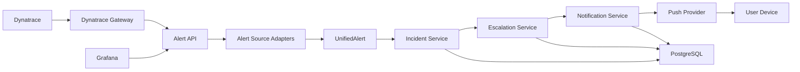
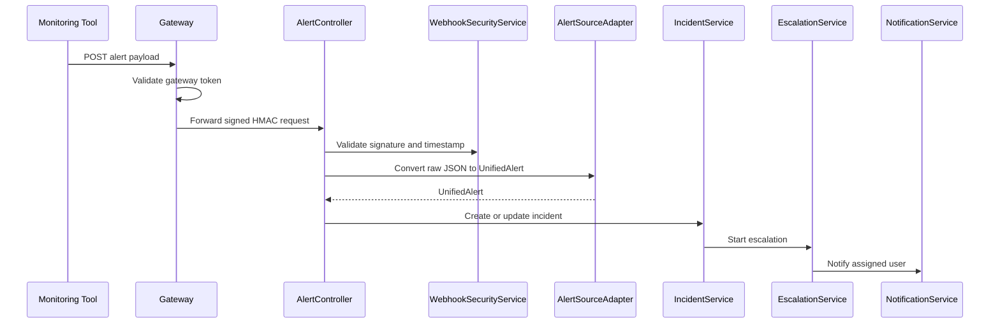
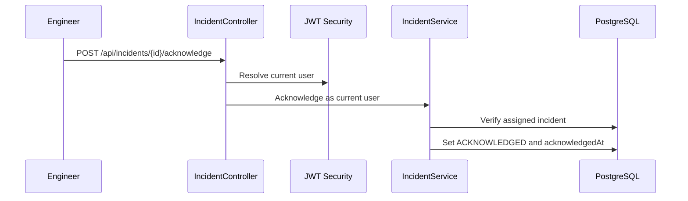

# Solution Architecture Document

## 1. Purpose

E-Pager is an alerting and escalation backend. It receives alerts from external monitoring systems, converts vendor-specific payloads into a common alert model, creates incidents, notifies the assigned user, and escalates if the user does not acknowledge the incident within the configured time.

The system is designed so the core incident and escalation logic is not tightly coupled to any specific monitoring tool such as Dynatrace or Grafana.

## 2. Business Goals

- Receive alerts from monitoring tools through secure webhook endpoints.
- Create a single incident model independent of the alert source.
- Notify the correct engineer based on project, support group, and escalation policy.
- Track delivery lifecycle from queued to sent, received, seen, or failed.
- Support role-based access for administrators, managers, and engineers.
- Provide auditability for webhook attempts and notification delivery.
- Allow future integration with more monitoring tools and real push providers.

## 3. High-Level Architecture



## 4. Major Components

### 4.1 Alert Ingestion

Package:

```text
com.example.epager.alert
```

Responsibilities:

- Accept alert POST requests.
- Validate webhook signatures using HMAC.
- Route payloads to the correct source adapter.
- Convert source payload into `UnifiedAlert`.
- Send unified alerts to incident creation logic.

Current sources:

- `grafana`
- `dynatrace`

Extension point:

```java
AlertSourceAdapter
```

Any new tool should implement this interface and return a source name plus conversion logic.

### 4.2 Dynatrace Gateway

Package:

```text
com.example.epager.gateway
```

Responsibilities:

- Accept Dynatrace webhook calls at `/gateway/webhooks/dynatrace`.
- Validate Dynatrace using a static bearer token.
- Generate E-Pager HMAC headers.
- Forward the exact raw JSON payload to `/api/alerts/dynatrace`.

Reason:

Dynatrace custom webhooks can send static headers, but cannot easily calculate E-Pager's dynamic HMAC signature. The gateway performs that security translation.

### 4.3 Incident Management

Package:

```text
com.example.epager.incident
```

Responsibilities:

- Create incidents from unified alerts.
- Avoid duplicate active incidents for the same external alert ID.
- Store status: `TRIGGERED`, `ACKNOWLEDGED`, `RESOLVED`.
- Track assigned user, acknowledgement, and resolution.
- Restrict engineer access to assigned incidents.

### 4.4 Escalation Management

Package:

```text
com.example.epager.escalation
```

Responsibilities:

- Start escalation when an incident is created.
- Assign the first escalation level user.
- Schedule next escalation time.
- Escalate triggered incidents when the wait time expires.
- Maintain escalation events.

Current default seed policy:

```text
Project: payments
Group: primary-support
Level 1: Shivam Engineer after immediate assignment
Level 2: Ravi Lead after 5 minutes
Level 3: Manish Manager after 10 more minutes
```

### 4.5 Notification Management

Package:

```text
com.example.epager.notification
```

Responsibilities:

- Locate active devices for assigned users.
- Create notification logs.
- Send push notification through configured provider.
- Track notification lifecycle:

```text
QUEUED -> SENT -> RECEIVED -> SEEN
QUEUED -> FAILED
```

Providers:

- Simulated push provider, default.
- Firebase Cloud Messaging provider, enabled using config.

### 4.6 User, Project, and Support Group Management

Packages:

```text
com.example.epager.user
com.example.epager.project
```

Responsibilities:

- Manage users and roles.
- Manage projects.
- Manage support groups.
- Map users to support groups.
- Store device tokens.

### 4.7 Security

Packages:

```text
com.example.epager.security
com.example.epager.webhook
```

Security mechanisms:

- JWT login for UI/API users.
- Role-based endpoint access.
- HMAC webhook validation.
- Webhook timestamp validation.
- Webhook audit logs.
- Dynatrace gateway bearer token.

Roles:

```text
ADMIN    -> manage users, projects, webhook sources, escalation policies
MANAGER  -> manage escalation policies and incidents
ENGINEER -> view, acknowledge, and resolve assigned incidents
```

## 5. Runtime View

### 5.1 Alert Creation Flow



### 5.2 Engineer Acknowledgement Flow



## 6. Deployment View

Current local deployment:

```text
Developer machine
  - Java 17
  - Maven
  - PostgreSQL
  - Spring Boot app on port 8080
```

Recommended production deployment:

```text
Internet
  -> HTTPS load balancer / API gateway
  -> E-Pager Spring Boot service
  -> PostgreSQL
  -> Firebase Cloud Messaging
```

Future production split:

```text
Internet
  -> Webhook Gateway service
  -> Private E-Pager service
  -> PostgreSQL
```

## 7. Data Stores

Primary database:

```text
PostgreSQL
```

Schema managed by:

```text
Flyway migrations under src/main/resources/db/migration
```

Important tables:

- `app_users`
- `projects`
- `support_groups`
- `support_group_members`
- `escalation_policies`
- `escalation_levels`
- `incidents`
- `escalation_events`
- `user_devices`
- `notification_logs`
- `notification_delivery_events`
- `webhook_source`
- `webhook_audit_log`

## 8. Technology Stack

- Java 17
- Spring Boot 3.3.5
- Spring Web
- Spring Data JPA
- Spring Security
- PostgreSQL
- Flyway
- Springdoc OpenAPI / Swagger UI
- Firebase Admin SDK
- Maven

## 9. Key Design Decisions

### Unified Alert Model

Monitoring tools send different payload shapes. E-Pager converts them into `UnifiedAlert` before incident creation.

Benefit:

- Incident and escalation logic remains tool-independent.

### HMAC Webhook Security

Alert creation is sensitive. E-Pager validates:

- source name
- timestamp
- signature
- configured secret

Benefit:

- Prevents fake incident creation from unauthenticated callers.

### Pluggable Notification Provider

`NotificationProvider` hides the push implementation.

Benefit:

- Simulated push can be used locally.
- FCM can be enabled for real push.
- Future SMS/email/call providers can be added.

### Role-Based API Access

Security rules match operational responsibilities.

Benefit:

- Admin controls configuration.
- Manager controls escalation policies and incident handling.
- Engineer handles only assigned incidents.

## 10. Current Limitations

- No frontend UI.
- No native mobile app.
- No full on-call rotation calendar.
- JWT is custom-built for current learning scope, not yet using a standard JWT library.
- Firebase provider is implemented, but real push requires a Firebase project and real client registration tokens.
- Gateway is currently inside the E-Pager app, not a separate deployed service.

## 11. References Inside Project

- API docs: `docs/03-api-documentation.md`
- Install guide: `docs/04-installation-deployment-guide.md`
- Future roadmap: `docs/07-future-enhancements-proposal.md`
