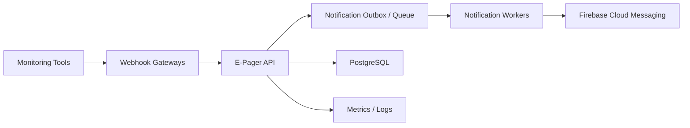

# Future Enhancements Proposal

## 1. Purpose

This document proposes future enhancements for E-Pager after the current backend foundation.

## 2. Current Baseline

Implemented:

- Alert ingestion
- Grafana adapter
- Dynatrace adapter
- Dynatrace gateway
- Unified alert model
- Incident lifecycle
- Escalation policies
- Notification logs
- Delivery tracking
- Simulated push provider
- Firebase Cloud Messaging provider
- PostgreSQL
- Flyway
- JWT login
- Role-based access
- Swagger
- PostgreSQL integration tests for role access
- Standard JWT library
- Refresh token rotation
- Password change with refresh-token revocation

## 3. Roadmap Overview

```text
Phase 1: Testing hardening
Phase 2: Notification reliability
Phase 3: On-call scheduling
Phase 4: Production security
Phase 5: Observability
Phase 6: Admin/user experience
Phase 7: Deployment automation
```

## 4. Phase 1: Testing Hardening

Priority:

```text
High
```

Enhancements:

- Valid HMAC alert creates incident.
- Missing signature rejected.
- Invalid signature rejected.
- Expired timestamp rejected.
- Webhook audit log created for success and failure.
- Dynatrace gateway valid token forwards alert.
- Dynatrace gateway invalid token rejected.
- Grafana adapter mapping tests.
- Dynatrace adapter mapping tests.
- Escalation scheduler tests.
- Notification delivery tracking tests.

Benefit:

- Protects critical alert entry point.
- Prevents security regression.
- Makes future refactoring safer.

## 5. Phase 2: Notification Reliability

Priority:

```text
High
```

Enhancements:

- Add retry policy for notification failures.
- Add notification attempt count.
- Add retry-after timestamp.
- Add dead-letter state.
- Add transactional outbox pattern.
- Move provider sending outside main incident transaction.

Proposed flow:

```text
Incident created
  -> notification_outbox row created
  -> async worker sends push
  -> result persisted
  -> retry if transient failure
```

Benefit:

- Reduces risk of lost notifications.
- Handles temporary Firebase/network failures.
- Better operational reliability.

## 6. Phase 3: On-Call Scheduling

Priority:

```text
High
```

Current limitation:

Escalation policies point to fixed users.

Enhancements:

- On-call schedules.
- Rotations.
- Overrides.
- Holidays.
- Time zones.
- Primary and secondary on-call users.

Proposed entities:

- `on_call_schedules`
- `on_call_rotations`
- `on_call_shifts`
- `on_call_overrides`

Benefit:

- Real pager systems require dynamic assignment.
- Reduces manual policy updates.

## 7. Phase 4: Production Security

Priority:

```text
High
```

Already implemented:

- Standard JJWT library for access tokens.
- Refresh tokens with hashed database storage.
- Refresh token rotation.
- Password change with active refresh-token revocation.

Enhancements:

- Add password reset.
- Add account lockout after failed login attempts.
- Add rate limiting.
- Add admin audit log.
- Add webhook secret rotation.
- Add encrypted secret storage.

Benefit:

- Production-grade identity and access control.
- Better compliance and audit readiness.

## 8. Phase 5: Observability

Priority:

```text
Medium
```

Enhancements:

- Spring Boot Actuator.
- Health endpoint.
- Prometheus metrics.
- Structured JSON logging.
- Correlation ID for alert flow.
- Dashboard for:
  - alerts received
  - incidents created
  - escalation count
  - notification success/failure
  - webhook rejection reasons

Benefit:

- Easier operations.
- Faster troubleshooting.
- Better production support.

## 9. Phase 6: Admin and User Experience

Priority:

```text
Medium
```

Enhancements:

- Admin web UI.
- Manager incident dashboard.
- Engineer incident dashboard.
- Device registration UI.
- Push notification click handling.
- Escalation policy editor.
- Webhook source editor.
- Audit log viewer.

Benefit:

- Makes E-Pager usable without Swagger.
- Enables demos and real operational use.

## 10. Phase 7: Deployment Automation

Priority:

```text
Medium
```

Enhancements:

- Dockerfile.
- Docker Compose with PostgreSQL.
- CI workflow.
- Test pipeline.
- Environment-specific config.
- Deployment scripts.

Benefit:

- Repeatable setup.
- Easier sharing and deployment.

## 11. Additional Monitoring Tool Integrations

Possible sources:

- Prometheus Alertmanager
- AWS CloudWatch
- Azure Monitor
- Google Cloud Monitoring
- New Relic
- Datadog

Pattern:

```text
Tool Gateway if needed
  -> /api/alerts/{source}
  -> SourceAdapter
  -> UnifiedAlert
```

Development steps per tool:

1. Add webhook source.
2. Add adapter.
3. Add gateway if tool cannot sign HMAC.
4. Add tests.
5. Add documentation.

## 12. Recommended Immediate Next Steps

Tomorrow testing roadmap:

1. Add webhook/HMAC integration tests.
2. Add gateway forwarding test.
3. Add webhook audit tests.
4. Add adapter mapping tests.

Next development roadmap:

1. Notification retry/outbox.
2. On-call schedule.
3. Actuator and metrics.
4. Password reset, account lockout, and rate limiting.
5. Docker deployment.

## 13. Success Metrics

Operational metrics:

- Alert ingestion latency.
- Incident creation success rate.
- Webhook rejection rate.
- Notification delivery success rate.
- Average acknowledgement time.
- Escalation rate.
- Mean time to acknowledge.
- Mean time to resolve.

Engineering metrics:

- Test coverage for critical flows.
- Build success rate.
- Deployment frequency.
- Regression count.

## 14. Proposed Target Architecture



## 15. Final Recommendation

E-Pager should continue with testing-first hardening before adding more features. The current architecture is extensible, but the alert and security boundaries must be protected with automated tests before production-level usage.
